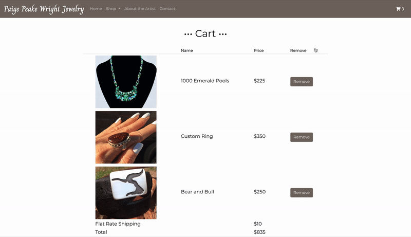

# Paige Peake Wright Jewelry #

**Live Link:** https://paigepeakewrightjewerly.herokuapp.com/

Paige Peake Wright Jewelry (PPWJ) is an E-commerce site for a local Jewelry designer. Users are able to browse and filter products,
add items to their shopping cart, and purchase their items. Once items are purchased, Users receive a confirmation email detailing their purchase.
The site also has an admin side where the store owner can add, edit, or delete inventory.

**Technologies Used:** Node.js, JavaScript, PostgreSQL, Stripe API, Express, Express-Session, Sequelize, Bcrypt, BootStrap, CSS

### Filtering Products:

### Adding Items to Shopping Cart:

### Purchasing Items:

### Administrative Page:

# Collaborators:
* [Ashley Mello](https://github.com/AshMello)
* [Summer Feiler](https://github.com/spfeiler)
